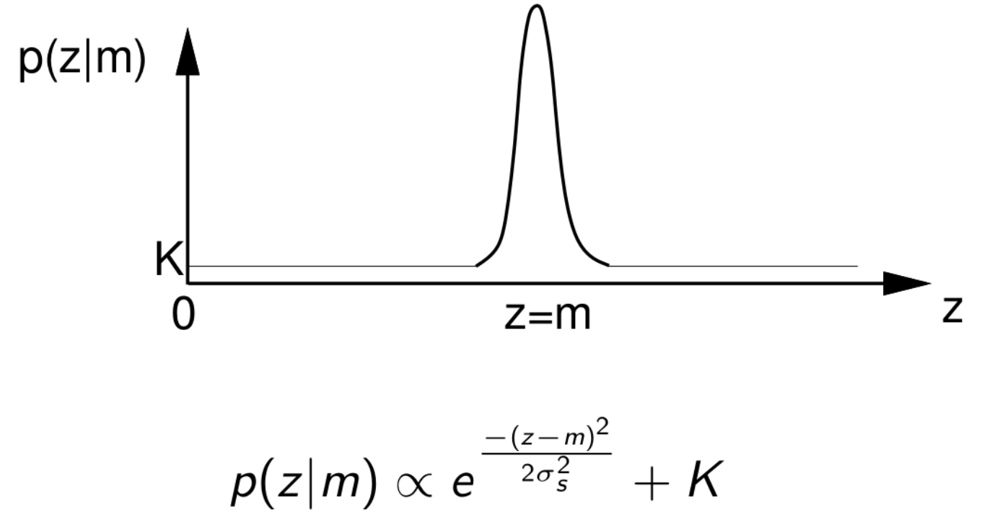

# Robotics-EIE3
## Robotics Assignment 4: Monte Carlo Localisation
[**The handout**](../Resources/questions5.pdf)

### Intro
The main parts of one step of MCL are:
1. Motion Prediction based on Odometry
2. Measurement Update based on Sonar
3. Normalisation
4. Resampling

The robot is able to move around the mapped environment in small steps of 20cm, pausing after each movement.

  During motion, the particle distribution will be updated to represent the uncertain motion measured by odometry.  
  After motion, the robot makes a sonar measurement of the distance to the wall in front, and use this to adjust the particle weights based on a likelihood function.  
  Then, it will normalise and resample the particle distribution and be ready to complete another motion step.  

By repeating these steps, the robot is able to keep track of its location accurately (at least up to the limits of what is possible with only one sonar sensor).

The particle distribution for each step will be displayed in the web interface.

### The Environment and Map

The coordinates of the vertex are:

| Point |  x  |  y  |
|:-----:|:---:|:---:|
|O      |0    |0    |
|A      |0    |168    |
|B      |84    |168    |
|C      |84    |126    |
|D      |84    |210    |
|E      |168    |210    |
|F      |168    |84    |
|G      |210    |84    |
|H      |210    |0    |

### Using the Sonar
The sonar is not mounted above the rotation centre of the robot. An offset of `<what?>` is added to the sonar readings.

### _3.1_ Sonar Likelihood and Measurement Update (12 Marks)
Function `__calculate_likelihood()` in [partice.py](../src/particle.py)  
Using Gaussian Distribution to calculate likelihood for each particle based on `(ultrasound_measurement - predicted_distance)`

The robust likelihood function model the fact that eal sensors sometimes report 'garbage' values.
A constant `K=0.05` is added to the Gaussian Distribution to model there is some constant probability that the sensor will return a garbage value, uniformly distributed across the range of the sensor.

On the other hand, the robust likelihood function is less aggressive in 'killing off' particles which are far from agreeing with measurements. But an occasional garbage measurement will not lead to the sudden death of all the particles in good positions.

##### Constituents in `particle.py`
1. Find out which wall the sonar beam would hit. -> `??`
2. Calculate the expected depth measurement. -> `__predict_distance_to_nearest_wall()`
3. Calculate the likelihood value for each particle. -> `__calculate_likelihood()`
4. Set likelihood value to `0.05` if the incident angle is greater than **15 degrees**. -> `__calculate_likelihood()` -> `__predict_distance_to_nearest_wall()`

### _3.2_ Normalising and Resampling (12 Marks)
#### Normalisation
Implemented in [particle.py](../src/particle.py) `:: __normalise_weights()`.  
Add up all the weights in the unnormalised set, and then divide the weight of each by this total.

#### Resample
Implemented in [particle.py](../src/particle.py) `:: __resample()`.

> Strong and successful particles get to reproduce and weak ones die out!

Given a particle set of N particles with varying but normalised weights as the starting point, resampling 
generates N new particles whose weights are all equal to 1/N but whose spatial distribution now represents 
the previous weighted distribution.  
Therefore, we get many copies of the strong particles, and few or in many cases no copies of the weak particles.

The random choosing of particles to copy proportionally to their weights is achieved by building a cumulative 
weight array and then generating random numbers between 0 and 1.

Finally, the new set of particles overwrites the old one.

### _3.3_ Waypoint-Based Navigation While Localising (6 marks)
Accurate sequential navigation can be achieved using continuous MCL.

A point estimate of the current position and orientation of the robot can be made by taking the mean of all the particles. The robot can navigate to the next point based on current point estimate. All particles get updated based outward-looking(exteroceptive) sensors as the robot travels, so that cumulative errors are eliminated.

Waypoints to travel:

| x  | y  |
|:--:|:--:|
|84  |30  |
|180 |30  |
|84  |54  |
|138 |54  |
|138 |168 |
|114 |168 |
|114 |84  |
|84  |84  |
|84  |30  |
